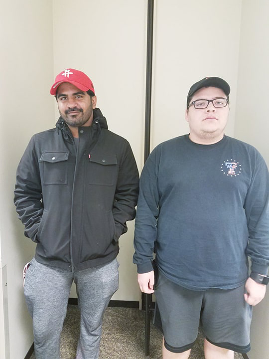
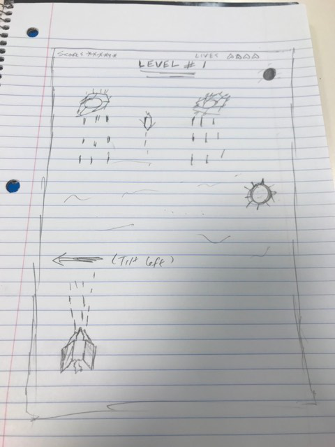

[Presentation](https://elozano2.github.io/Andromeda-2050/)  
[Repo](https://github.com/elozano2/Andromeda-2050)  
[Demo](https://elozano2.github.io/Andromeda2050Game/)

## Andromeda 2050
#### Eduardo Lozano, Manoj Khatri  

  

    

Introduction
===

Andromeda 2050 is a 2D space shooter where the player is tasked to shoot  
enemy ships while avoiding various hazards, such as enemy lasers.  

The player starts with three lives and loses a life each time their ship is hit by a hazard.  
If the player runs out of lives, they lose the game and must start over.  

Sketch
===  
  

Implementation and Plan to Move Forward
===  
So far, we have gotten the game to a playable state.  
Players can play the game and attempt to get a high score.  

#### Features we plan on adding include:  
* Gesture controls  
* Levels (Player must reach end of level to win)
* Different enemy ship types
* Powerups
* Game polishing and bug fixes

#### How to play game  
You can play the game by clicking on the demo link at the top of this page.  

#### Controls:  
W to move forward  
A to move left  
S to move back  
D to move right  

#### Hypothesis  
Since the game is simplistic, players will have and easy time picking up the game and understanding  
what the objective is.
